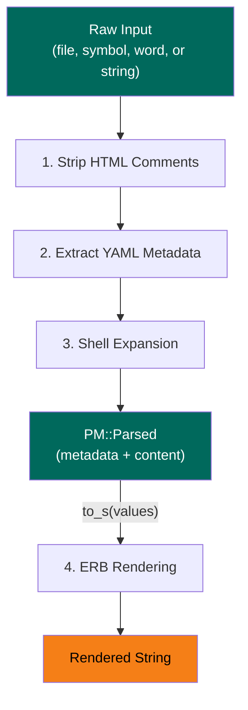
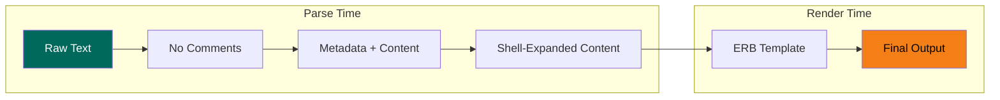

# Processing Pipeline

PM processes prompts through a four-stage pipeline. The first three stages run at parse time; the fourth runs on demand when `to_s` is called.

## Overview



## Stage 1: Strip HTML Comments

**When:** Parse time
**Method:** `PM.strip_comments`

All `<!-- ... -->` comments are removed, including multiline spans. This runs first so comments don't interfere with metadata extraction.

```
Input:  "<!-- draft -->\n---\ntitle: Test\n---\nContent <!-- note -->"
Output: "\n---\ntitle: Test\n---\nContent "
```

## Stage 2: Extract YAML Metadata

**When:** Parse time
**Regex:** `PM::METADATA_REGEXP`

The `---`-delimited front-matter is parsed with `YAML.safe_load` into a Hash, then wrapped in a `PM::Metadata` object. Global defaults for `shell` and `erb` are applied if the file doesn't specify them.

For file sources, `directory`, `name`, `created_at`, and `modified_at` are added from file stats.

```
Input:  "---\ntitle: Test\nshell: true\n---\nContent"
Output: metadata = PM::Metadata(title: "Test", shell: true, erb: true)
        content  = "Content"
```

## Stage 3: Shell Expansion

**When:** Parse time (if `shell: true`)
**Method:** `PM.expand_shell`

Two sub-stages run in order:

### 3a. Command Substitution

`$(command)` sequences are found (with proper nesting of parentheses), executed, and replaced with stdout.

### 3b. Environment Variables

`$VAR` and `${VAR}` patterns (UPPERCASE only) are replaced with the corresponding environment variable value. Missing variables become empty strings.

```
Input:  "User: $USER\nDate: $(date +%Y-%m-%d)"
Output: "User: dewayne\nDate: 2025-01-15"
```

## Stage 4: ERB Rendering

**When:** On demand (`to_s` call, if `erb: true`)
**Method:** `PM::Parsed#to_s`

The content is evaluated as an ERB template. Parameter values (defaults merged with `to_s` arguments) and registered directives are available as local methods in the template.

This stage also handles the `include` directive, which recursively parses and renders included files through the full pipeline.

```
Input:  "Hello, <%= name %>!"  (with params: {name: "Alice"})
Output: "Hello, Alice!"
```

## Conditional Stages

Stages 3 and 4 can be independently disabled:

| Setting | Effect |
|---------|--------|
| `shell: false` | Stage 3 skipped; `$VAR` and `$(cmd)` preserved |
| `erb: false` | Stage 4 skipped; `<%= ... %>` preserved |

Settings can be per-file (YAML metadata) or global (`PM.configure`). Per-file always wins.

## Data Flow



The `PM::Parsed` object returned by `PM.parse` holds the result of stages 1-3. Calling `to_s` triggers stage 4 and returns the final string.
