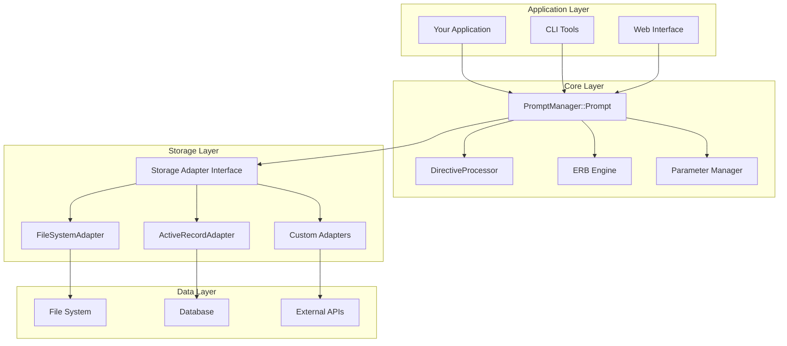
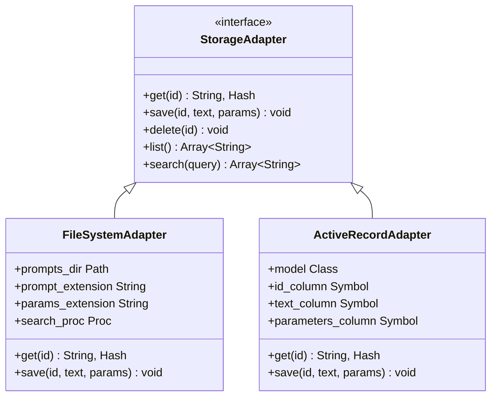
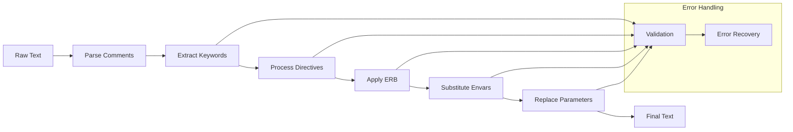
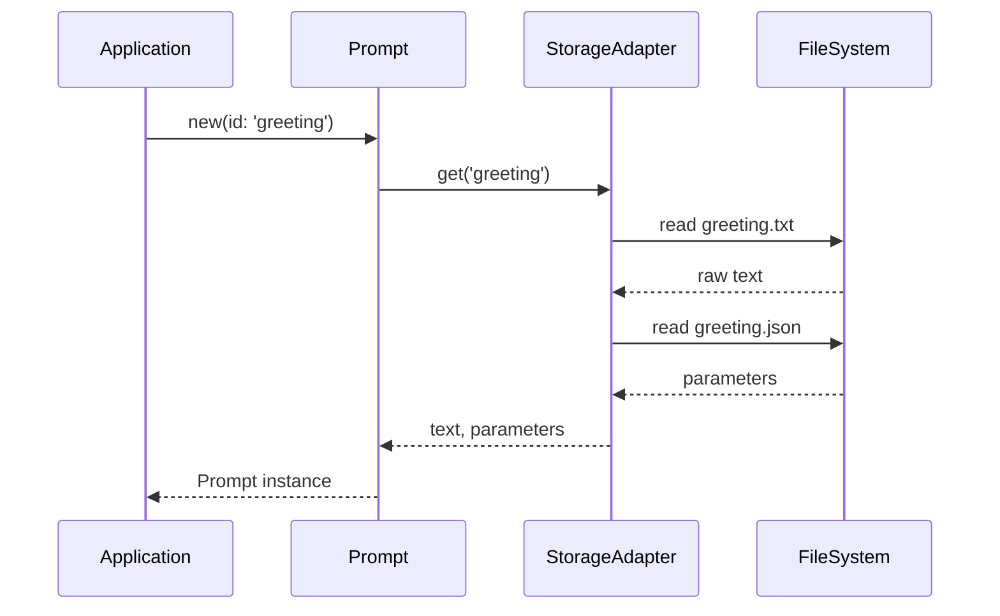
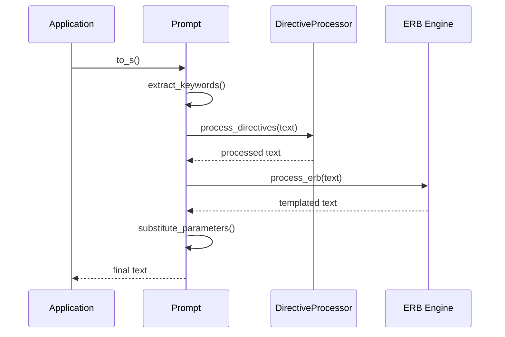
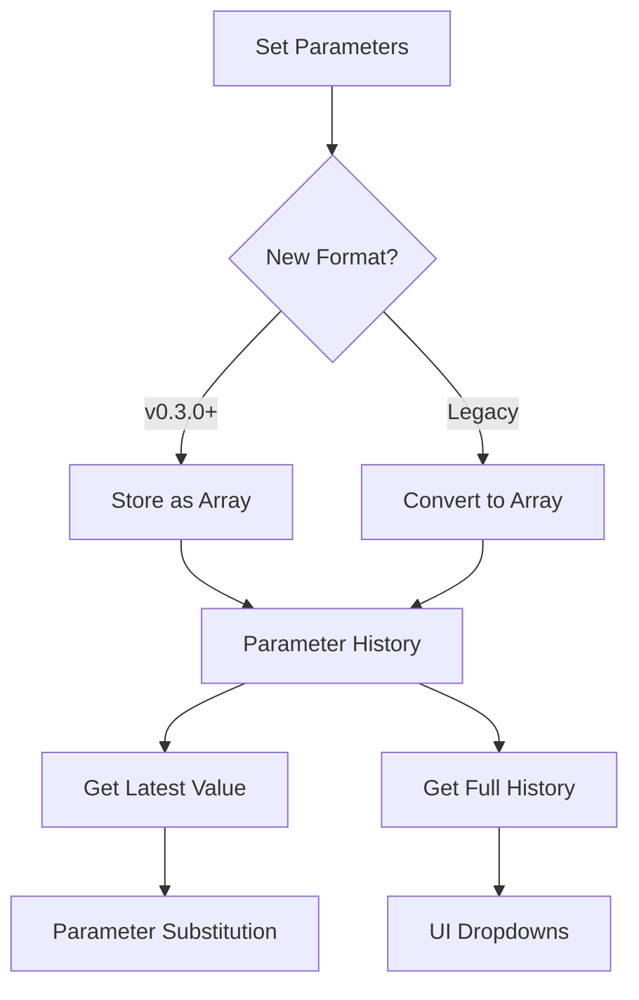
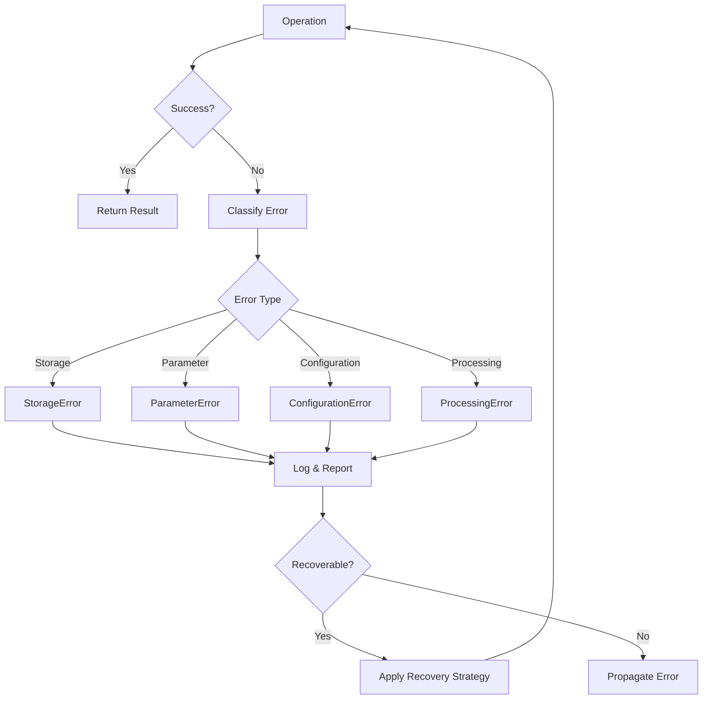

# Architecture

PromptManager follows a modular, layered architecture designed for flexibility, extensibility, and maintainability.

## High-Level Architecture



## Core Components

### 1. Prompt Class

The central `PromptManager::Prompt` class orchestrates all functionality:

```ruby
class PromptManager::Prompt
  attr_accessor :id, :parameters, :context
  attr_reader :keywords, :directives
  
  def initialize(options = {})
    @id = options[:id]
    @context = options[:context] || []
    @directives_processor = options[:directives_processor]
    @erb_flag = options[:erb_flag] || false
    @envar_flag = options[:envar_flag] || false
  end
  
  def to_s
    # Processing pipeline
    text = load_raw_text
    text = process_directives(text)
    text = process_erb(text) if @erb_flag
    text = substitute_envars(text) if @envar_flag
    text = substitute_parameters(text)
    text
  end
end
```

### 2. Storage Adapter Pattern

Storage adapters implement a common interface:



### 3. Processing Pipeline

The prompt processing follows a well-defined pipeline:



## Design Patterns

### 1. Adapter Pattern

Storage adapters use the Adapter pattern to provide a consistent interface across different storage backends:

```ruby
# Common interface
module StorageAdapter
  def get(id)
    raise NotImplementedError
  end
  
  def save(id, text, parameters)  
    raise NotImplementedError
  end
end

# Specific implementations
class FileSystemAdapter
  include StorageAdapter
  
  def get(id)
    text = File.read(prompt_path(id))
    params = JSON.parse(File.read(params_path(id)))
    [text, params]
  end
end
```

### 2. Strategy Pattern

Directive processing uses the Strategy pattern for different directive types:

```ruby
class DirectiveProcessor
  def process_directive(directive, prompt)
    case directive
    when /^\/\/include (.+)$/
      IncludeStrategy.new.process($1, prompt)
    when /^\/\/import (.+)$/  
      ImportStrategy.new.process($1, prompt)
    else
      raise "Unknown directive: #{directive}"
    end
  end
end
```

### 3. Template Method Pattern

The prompt generation uses Template Method pattern:

```ruby
class Prompt
  def to_s
    template_method
  end
  
  private
  
  def template_method
    text = load_text          # Hook 1
    text = preprocess(text)   # Hook 2  
    text = process(text)      # Hook 3
    text = postprocess(text)  # Hook 4
    text
  end
  
  # Hooks can be overridden by subclasses
  def preprocess(text); text; end
  def process(text); substitute_parameters(text); end
  def postprocess(text); text; end
end
```

### 4. Configuration Object Pattern

Storage adapters use configuration objects for flexible setup:

```ruby
class FileSystemAdapter
  attr_reader :config
  
  def self.config(&block)
    @config ||= Configuration.new
    block.call(@config) if block_given?
    self
  end
  
  class Configuration  
    attr_accessor :prompts_dir, :prompt_extension, :params_extension
    
    def initialize
      @prompts_dir = nil
      @prompt_extension = '.txt'
      @params_extension = '.json'
    end
  end
end
```

## Data Flow

### 1. Prompt Loading



### 2. Prompt Processing



### 3. Parameter Management



## Extension Points

The architecture provides several extension points for customization:

### 1. Custom Storage Adapters

```ruby
class RedisAdapter
  include PromptManager::StorageAdapter
  
  def initialize(redis_client)
    @redis = redis_client
  end
  
  def get(id)
    text = @redis.get("prompt:#{id}:text")
    params_json = @redis.get("prompt:#{id}:params")
    params = JSON.parse(params_json || '{}')
    [text, params]
  end
end
```

### 2. Custom Directive Processors

```ruby  
class CustomDirectiveProcessor < PromptManager::DirectiveProcessor
  def process_directive(directive, prompt)
    case directive
    when /^\/\/model (.+)$/
      @model = $1
      ""  # Remove directive from output
    when /^\/\/temperature (.+)$/
      @temperature = $1.to_f
      ""
    else
      super  # Delegate to parent
    end
  end
end
```

### 3. Custom Keyword Patterns

```ruby
# Support multiple keyword formats
class MultiPatternPrompt < PromptManager::Prompt
  PATTERNS = [
    /(\[[A-Z _|]+\])/,           # [KEYWORD]
    /(\{\{[a-z_]+\}\})/,         # {{keyword}}  
    /(:[a-z_]+)/                 # :keyword
  ]
  
  def extract_keywords(text)
    keywords = []
    PATTERNS.each do |pattern|
      keywords.concat(text.scan(pattern).flatten)
    end
    keywords.uniq
  end
end
```

## Performance Considerations

### 1. Lazy Loading

```ruby
class Prompt
  def keywords
    @keywords ||= extract_keywords(@raw_text)
  end
  
  def raw_text
    @raw_text ||= storage_adapter.get(@id).first
  end
end
```

### 2. Caching

```ruby
class CachingStorageAdapter
  def initialize(adapter, cache_store = {})
    @adapter = adapter
    @cache = cache_store
  end
  
  def get(id)
    @cache[id] ||= @adapter.get(id)
  end
end
```

### 3. Batch Operations

```ruby
class BatchProcessor  
  def process_prompts(prompt_ids)
    # Load all prompts at once
    prompts_data = storage_adapter.get_batch(prompt_ids)
    
    # Process in parallel
    results = prompts_data.map do |id, (text, params)|
      Thread.new { process_single_prompt(id, text, params) }
    end.map(&:value)
    
    results
  end
end
```

## Error Handling Architecture  



### Error Hierarchy

```ruby
module PromptManager
  class Error < StandardError; end
  
  class StorageError < Error
    attr_reader :operation, :id
    
    def initialize(message, operation: nil, id: nil)
      super(message)
      @operation = operation
      @id = id
    end
  end
  
  class ParameterError < Error
    attr_reader :missing_params, :invalid_params
  end
  
  class ConfigurationError < Error
    attr_reader :setting, :value
  end
  
  class ProcessingError < Error
    attr_reader :stage, :directive
  end
end
```

## Security Considerations

### 1. Parameter Sanitization

```ruby
class SecurePrompt < Prompt
  def substitute_parameters(text)
    safe_params = sanitize_parameters(@parameters)
    super(text, safe_params)
  end
  
  private
  
  def sanitize_parameters(params)
    params.transform_values do |value|
      # Remove potential injection attacks
      value.gsub(/[<>'"&]/, '')
    end
  end
end
```

### 2. File System Security

```ruby
class SecureFileSystemAdapter < FileSystemAdapter
  def prompt_path(id)
    # Prevent directory traversal
    sanitized_id = id.gsub(/[^a-zA-Z0-9_-]/, '')
    raise SecurityError, "Invalid prompt ID" if sanitized_id != id
    
    File.join(@config.prompts_dir, "#{sanitized_id}.txt")
  end
end
```

## Testing Architecture

The architecture supports comprehensive testing at multiple levels:

### 1. Unit Tests
- Individual component testing
- Mock storage adapters for isolation
- Parameter validation testing

### 2. Integration Tests  
- End-to-end prompt processing
- Multiple storage adapter combinations
- Error handling scenarios

### 3. Performance Tests
- Large prompt collections
- Concurrent access patterns  
- Memory usage optimization

## Future Architecture Goals

### 1. Plugin System
- Dynamic directive loading
- Community-contributed processors
- Runtime plugin management

### 2. Distributed Storage
- Multi-node prompt storage
- Replication and consistency
- Fault tolerance

### 3. Real-time Updates
- Live prompt editing
- Change notification system
- Collaborative editing support

This architecture provides a solid foundation for current needs while remaining flexible enough to support future enhancements and extensions.