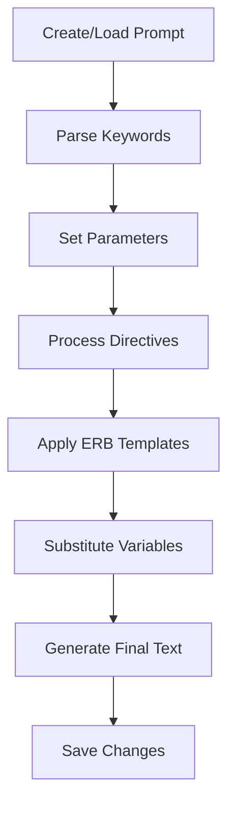

# Basic Concepts

Understanding these core concepts will help you make the most of PromptManager.

## The Prompt Lifecycle

Every prompt in PromptManager follows a predictable lifecycle:



## Core Components

### 1. Prompts

A **Prompt** is the central entity in PromptManager. It represents a template with:

- **Text content** with embedded keywords
- **Parameters** (values for keywords)
- **Metadata** (directives, comments, configuration)

```ruby
prompt = PromptManager::Prompt.new(
  id: 'example',           # Unique identifier
  erb_flag: true,          # Enable ERB processing
  envar_flag: true         # Enable environment variables
)
```

### 2. Keywords

**Keywords** are placeholders in your prompt text that get replaced with actual values:

```text
Hello [NAME], today is [DATE] and the weather is [WEATHER].
```

Default keyword format: `[UPPERCASE_WITH_UNDERSCORES]`

You can customize this pattern:

```ruby
# Use {{mustache}} style
PromptManager::Prompt.parameter_regex = /(\{\{[a-z_]+\}\})/

# Use :symbol style  
PromptManager::Prompt.parameter_regex = /(:[a-z_]+)/
```

### 3. Parameters

**Parameters** are the actual values that replace keywords:

```ruby
prompt.parameters = {
  "[NAME]" => "Alice",
  "[DATE]" => Date.today.to_s,
  "[WEATHER]" => "sunny"
}
```

Since v0.3.0, parameters store history as arrays:

```ruby
prompt.parameters = {
  "[NAME]" => ["Alice", "Bob", "Charlie"]  # Charlie is most recent
}
```

### 4. Storage Adapters

**Storage Adapters** handle how prompts are persisted:

=== "FileSystem"

    ```ruby
    PromptManager::Storage::FileSystemAdapter.config do |config|
      config.prompts_dir = '~/.prompts'
      config.prompt_extension = '.txt'
      config.params_extension = '.json'
    end
    ```

=== "ActiveRecord"

    ```ruby
    PromptManager::Storage::ActiveRecordAdapter.config do |config|
      config.model = PromptModel
      config.id_column = :name
      config.text_column = :content
      config.parameters_column = :params
    end
    ```

### 5. Directives

**Directives** are special instructions that start with `//`:

```text
//include common/header.txt
//import templates/[TEMPLATE_TYPE].txt

Your main prompt content here...
```

## File Structure (FileSystem Adapter)

When using the FileSystem adapter, your prompts are organized like this:

```
~/.prompts/
├── greeting.txt              # Prompt text
├── greeting.json             # Parameters
├── translation.txt
├── translation.json
└── common/
    ├── header.txt            # Shared components
    └── footer.txt
```

### Prompt Files (`.txt`)

```text title="greeting.txt"
# Description: Friendly greeting prompt
# Tags: customer-service, greeting
# Version: 1.2

//include common/header.txt

Hello [CUSTOMER_NAME]!

Thank you for contacting [COMPANY_NAME]. I'm here to help you with 
[REQUEST_TYPE]. Let me know how I can assist you today.

Best regards,
[AGENT_NAME]

__END__
Internal notes: This prompt is used for all initial customer contacts.
Update the company name parameter when client changes.
```

### Parameter Files (`.json`)

```json title="greeting.json"
{
  "[CUSTOMER_NAME]": ["Alice Johnson", "Bob Smith"],
  "[COMPANY_NAME]": ["Acme Corp"],
  "[REQUEST_TYPE]": ["general inquiry", "technical support", "billing"],
  "[AGENT_NAME]": ["Sarah", "Mike", "Jennifer"]
}
```

## Processing Pipeline

PromptManager processes prompts through several stages:

### 1. Text Loading
- Load raw prompt text from storage
- Parse out comments and `__END__` sections

### 2. Keyword Extraction  
- Scan text for keyword patterns
- Build list of required parameters

### 3. Directive Processing
- Process `//include` and `//import` directives
- Handle loop protection for circular includes
- Substitute keywords in directive paths

### 4. Template Processing
- Apply ERB templates if `erb_flag` is true
- Substitute environment variables if `envar_flag` is true

### 5. Parameter Substitution
- Replace keywords with parameter values
- Handle missing parameters (error or warning)

### 6. Final Assembly
- Combine processed components
- Return final prompt text

## Error Handling

PromptManager provides specific error types:

```ruby
begin
  prompt = PromptManager::Prompt.new(id: 'example')
  puts prompt.to_s
rescue PromptManager::StorageError => e
  puts "Storage problem: #{e.message}"
rescue PromptManager::ParameterError => e  
  puts "Parameter issue: #{e.message}"
rescue PromptManager::ConfigurationError => e
  puts "Config problem: #{e.message}"
end
```

### Common Error Scenarios

| Error Type | Common Cause | Solution |
|------------|--------------|----------|
| `StorageError` | File not found, permission denied | Check file paths and permissions |
| `ParameterError` | Missing parameter value | Set all required parameters |
| `ConfigurationError` | Invalid adapter config | Review adapter configuration |

## Best Practices

### 1. Organize Your Prompts

```
prompts/
├── common/              # Shared components
│   ├── headers/
│   ├── footers/
│   └── signatures/
├── customer-service/    # Domain-specific prompts
├── technical/
└── templates/           # Reusable templates
```

### 2. Use Meaningful Keywords

```text
# Good - descriptive and clear
[CUSTOMER_NAME], [ORDER_NUMBER], [DELIVERY_DATE]

# Avoid - unclear abbreviations  
[CN], [ON], [DD]
```

### 3. Document Your Prompts

```text
# Description: What this prompt does
# Tags: classification, tags
# Version: 1.0
# Author: Your Name
# Last Updated: 2024-01-15

//include common/disclaimer.txt

Your prompt content...

__END__
Internal notes, change history, and documentation go here.
This section is ignored by the processor.
```

### 4. Version Your Parameters

```json
{
  "_meta": {
    "version": "1.0",
    "updated": "2024-01-15",
    "notes": "Added new product categories"
  },
  "[CATEGORY]": ["electronics", "books", "clothing"]
}
```

## Advanced Concepts

### Parameter Validation

```ruby
# Custom validation in your application
def validate_parameters(prompt)
  required = prompt.keywords
  provided = prompt.parameters.keys
  missing = required - provided
  
  raise "Missing parameters: #{missing.join(', ')}" unless missing.empty?
end
```

### Dynamic Prompts

```text
# Template selection based on parameters
//include templates/[TEMPLATE_TYPE].txt

# Conditional content using ERB
<% if '[URGENCY]' == 'high' %>
🚨 URGENT: Immediate attention required
<% end %>
```

### Search Integration

```ruby
# Configure custom search
adapter.search_proc = ->(query) {
  # Use ripgrep for fast search
  `rg -l "#{query}" #{prompts_dir}`.split("\n").map { |f| 
    File.basename(f, '.txt') 
  }
}
```

## Next Steps

Now that you understand the basics:

1. **Try the examples** in [Core Features](../core-features/parameterized-prompts.md)
2. **Choose a storage adapter** in [Storage Adapters](../storage/overview.md)  
3. **Explore advanced features** in [Advanced Usage](../advanced/custom-keywords.md)
4. **See real applications** in [Examples](../examples/basic.md)