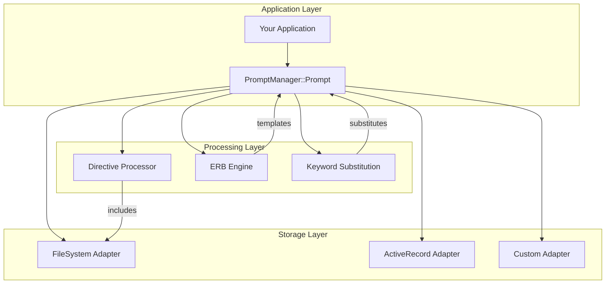

# PromptManager Documentation

<div align="center" style="background-color: #fff3cd; color: #856404; padding: 20px; margin: 20px 0; border: 2px solid #ffeaa7; border-radius: 5px; font-size: 18px; font-weight: bold;">
  ⚠️ CAUTION ⚠️<br />
  Breaking Changes are Coming<br />
  See <a href="development/roadmap/">Roadmap</a> for details
</div>

<div align="center">
  <table>
    <tr>
      <td width="40%" align="center" valign="top">
        
      </td>
      <td width="60%" align="left" valign="top">
        <p><strong>Like an enchanted librarian organizing floating books of knowledge, PromptManager helps you masterfully orchestrate and organize your AI prompts through wisdom and experience.</strong></p>
        
        <p>Each prompt becomes a living entity that can be categorized, parameterized, and interconnected with golden threads of relationships.</p>
        
        <h3>Key Features</h3>
        <ul>
            <li><strong>📚 <a href="storage/overview/">Multiple Storage Adapters</a></strong></li>
            <li><strong>🔧 <a href="core-features/parameterized-prompts/">Parameterized Prompts</a></strong></li>
            <li><strong>📋 <a href="core-features/directive-processing/">Directive Processing</a></strong></li>
            <li><strong>🎨 <a href="core-features/erb-integration/">ERB Integration</a></strong></li>
            <li><strong>🌍 <a href="core-features/shell-integration/">Shell Integration</a></strong></li>
            <li><strong>📖 <a href="core-features/comments/">Inline Documentation</a></strong></li>
            <li><strong>📊 <a href="core-features/parameter-history/">Parameter History</a></strong></li>
            <li><strong>⚡ <a href="core-features/error-handling/">Error Handling</a></strong></li>
            <li><strong>🔌 <a href="advanced/custom-keywords/">Extensible Architecture</a></strong></li>
        </ul>
      </td>
    </tr>
  </table>
</div>

## What is PromptManager?

PromptManager is a Ruby gem designed for managing parameterized prompts used in generative AI applications. It provides a sophisticated system for organizing, templating, and processing prompts with support for multiple storage backends, directive processing, and advanced templating features.

Think of it as your personal AI prompt librarian - organizing your prompts, managing their parameters, processing their directives, and ensuring they're always ready when you need them.

## Quick Start

Get up and running with PromptManager in minutes:

=== "Installation"

    ```bash
    gem install prompt_manager
    # or add to Gemfile
    bundle add prompt_manager
    ```

=== "Basic Usage"

    ```ruby
    require 'prompt_manager'

    # Configure storage
    PromptManager::Prompt.storage_adapter = 
      PromptManager::Storage::FileSystemAdapter.config do |config|
        config.prompts_dir = '~/.prompts'
      end.new

    # Use a prompt
    prompt = PromptManager::Prompt.new(id: 'greeting')
    prompt.parameters = {
      "[NAME]" => "Alice",
      "[LANGUAGE]" => "English"
    }
    
    puts prompt.to_s
    ```

=== "Create a Prompt"

    ```text
    # ~/.prompts/greeting.txt
    # Description: A friendly greeting prompt
    
    Hello [NAME]! How can I assist you today?
    Please respond in [LANGUAGE].
    ```

## Architecture Overview

PromptManager follows a modular architecture designed for flexibility and extensibility:



## Core Concepts

### Parameterized Prompts

Transform static prompts into dynamic templates:

```ruby
# Template with parameters
prompt_text = "Translate '[TEXT]' from [SOURCE_LANG] to [TARGET_LANG]"

# Filled with values
prompt.parameters = {
  "[TEXT]" => "Hello world",
  "[SOURCE_LANG]" => "English", 
  "[TARGET_LANG]" => "Spanish"
}

# Result: "Translate 'Hello world' from English to Spanish"
```

### Directive Processing

Use JCL-style directives for prompt composition:

```text
# Common header for all customer service prompts
//include common/customer_service_header.txt

# Dynamic template inclusion
//include templates/[TEMPLATE_TYPE].txt

Handle this customer inquiry about [TOPIC].
```

### Storage Adapters

Choose your preferred storage backend:

- **FileSystemAdapter**: Store prompts as text files
- **ActiveRecordAdapter**: Store prompts in a database  
- **Custom Adapters**: Build your own storage solution

## Why PromptManager?

### 🎯 **Organized Prompts**
Keep your prompts organized in a structured, searchable format instead of scattered across your codebase.

### 🔄 **Reusable Templates** 
Create parameterized templates that can be reused across different contexts and applications.

### 🛠️ **Powerful Processing**
Advanced features like directive processing, ERB templating, and environment variable substitution.

### 📈 **Scalable Architecture**
Modular design supports everything from simple scripts to enterprise applications.

### 🔍 **Easy Management**
Built-in search capabilities and parameter history make prompt management effortless.

## Getting Started

Ready to dive in? Here are some great places to start:

<div class="grid cards" markdown>

-   :fontawesome-solid-rocket:{ .lg .middle } __Quick Start__

    ---

    Get PromptManager running in your project within minutes
    
    [:octicons-arrow-right-24: Quick Start](getting-started/quick-start.md)

-   :fontawesome-solid-book:{ .lg .middle } __Core Features__

    ---

    Learn about parameterized prompts, directives, and more
    
    [:octicons-arrow-right-24: Core Features](core-features/parameterized-prompts.md)

-   :fontawesome-solid-database:{ .lg .middle } __Storage Adapters__

    ---

    Choose the right storage solution for your needs
    
    [:octicons-arrow-right-24: Storage Options](storage/overview.md)

-   :fontawesome-solid-code:{ .lg .middle } __API Reference__

    ---

    Complete reference for all classes and methods
    
    [:octicons-arrow-right-24: API Docs](api/prompt-class.md)

</div>

## Community & Support

- **GitHub**: [MadBomber/prompt_manager](https://github.com/MadBomber/prompt_manager)
- **RubyGems**: [prompt_manager](https://rubygems.org/gems/prompt_manager)
- **Issues**: [Report bugs or request features](https://github.com/MadBomber/prompt_manager/issues)
- **Discussions**: [Community discussions](https://github.com/MadBomber/prompt_manager/discussions)

## License

PromptManager is released under the [MIT License](https://opensource.org/licenses/MIT).