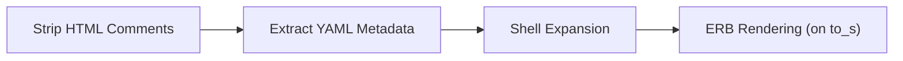

# PM (PromptManager)

<table>
<tr>
<td width="40%" align="center" valign="top">
  <br>
  <em>"Prompts with superpowers"</em>
</td>
<td width="60%" valign="top">
<strong>Parse YAML metadata from markdown, expand shell references, and render ERB templates on demand</strong><br><br>
PM (PromptManager) treats prompt files as composable, parameterized templates. Write prompts in markdown with YAML front matter, shell references, and ERB — PM handles the rest.

<h3>Key Features</h3>

<li> <strong>YAML Metadata</strong> - Parse from markdown strings or files<br>
<li> <strong>Shell Expansion</strong> - $VAR, ${VAR}, and $(command) substitution<br>
<li> <strong>ERB Rendering</strong> - On-demand rendering with named parameters<br>
<li> <strong>File Includes</strong> - Compose prompts from multiple files<br>
<li> <strong>Custom Directives</strong> - Register custom methods for ERB templates<br>
<li> <strong>Configurable Pipeline</strong> - Enable/disable stages per prompt or globally<br>
<li> <strong>Comment Stripping</strong> - HTML comments removed before processing
</td>
</tr>
</table>

## Processing Pipeline

Every prompt passes through four stages:


```mermaid
graph LR
    A[Strip HTML Comments] --> B[Extract YAML Metadata]
    B --> C[Shell Expansion]
    C --> D["ERB Rendering (on to_s)"]
```

1. **Strip HTML comments** -- `<!-- ... -->` removed before anything else
2. **Extract YAML metadata** -- Front-matter between `---` fences parsed into `PM::Metadata`
3. **Shell expansion** -- Environment variables and commands expanded (when `shell: true`)
4. **ERB rendering** -- Templates evaluated on demand when `to_s` is called (when `erb: true`)

## Quick Example

Given a file `review.md`:

```markdown
---
title: Code Review
parameters:
  language: ruby
  code: null
---
Review the following <%= language %> code:

<%= code %>
```

Parse and render:

```ruby
require 'pm'

parsed = PM.parse('review.md')
puts parsed.metadata.title        #=> "Code Review"
puts parsed.to_s('code' => source) #=> rendered prompt
```

## Getting Started

Head to [Installation](getting-started/installation.md) to add PM to your project, then follow the [Quick Start](getting-started/quick-start.md) guide.
