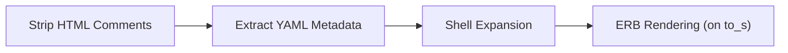

# PM (PromptManager)

PM parses YAML metadata from markdown strings or files. It expands shell references, extracts metadata and content, and renders ERB templates on demand.

## Key Features

- **YAML Metadata Extraction** -- Front-matter parsed into an OpenStruct-based object with dot notation and predicate methods
- **Shell Expansion** -- `$VAR`, `${VAR}`, and `$(command)` replaced at parse time
- **ERB Rendering** -- Templates rendered on demand with parameter substitution via `to_s`
- **File Includes** -- Compose prompts from multiple files with `<%= include 'path.md' %>`; nested includes and circular detection built in
- **Custom Directives** -- Register your own methods available inside ERB templates
- **Configurable Pipeline** -- Disable shell or ERB per-file or globally

## Processing Pipeline

Every prompt passes through four stages:


```mermaid
graph LR
    A[Strip HTML Comments] --> B[Extract YAML Metadata]
    B --> C[Shell Expansion]
    C --> D["ERB Rendering (on to_s)"]
```

1. **Strip HTML comments** -- `<!-- ... -->` removed before anything else
2. **Extract YAML metadata** -- Front-matter between `---` fences parsed into `PM::Metadata`
3. **Shell expansion** -- Environment variables and commands expanded (when `shell: true`)
4. **ERB rendering** -- Templates evaluated on demand when `to_s` is called (when `erb: true`)

## Quick Example

Given a file `review.md`:

```markdown
---
title: Code Review
parameters:
  language: ruby
  code: null
---
Review the following <%= language %> code:

<%= code %>
```

Parse and render:

```ruby
require 'pm'

parsed = PM.parse('review.md')
puts parsed.metadata.title        #=> "Code Review"
puts parsed.to_s('code' => source) #=> rendered prompt
```

## Getting Started

Head to [Installation](getting-started/installation.md) to add PM to your project, then follow the [Quick Start](getting-started/quick-start.md) guide.
