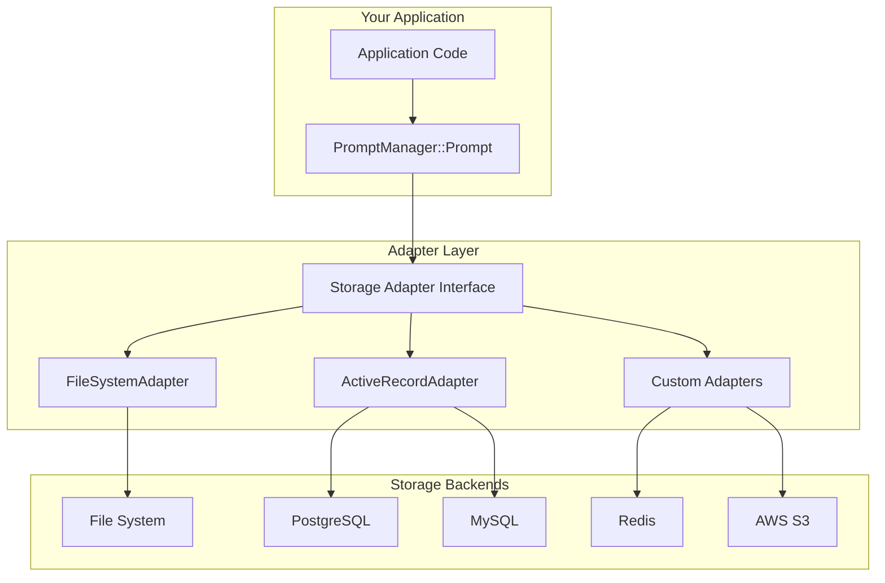

# Storage Adapters Overview

Storage adapters are the backbone of PromptManager, providing the interface between your prompts and their persistence layer. They allow you to store prompts in various backends while maintaining a consistent API.

## What are Storage Adapters?

Storage adapters implement a common interface that handles:

- **Loading** prompt text and parameters
- **Saving** changes back to storage  
- **Listing** available prompts
- **Searching** through prompt collections
- **Managing** prompt metadata

Think of them as the "database drivers" for your prompts - they handle the specifics of where and how your prompts are stored.

## Adapter Architecture



## Available Adapters

PromptManager includes two built-in adapters:

### FileSystemAdapter
- **Best for**: Development, small teams, file-based workflows
- **Storage**: Local files (`.txt` for prompts, `.json` for parameters)
- **Features**: Simple setup, version control friendly, human-readable
- **Use cases**: Personal projects, documentation, prototype development

### ActiveRecordAdapter  
- **Best for**: Web applications, enterprise deployments, shared access
- **Storage**: Any database supported by ActiveRecord (PostgreSQL, MySQL, SQLite, etc.)
- **Features**: Transactions, concurrent access, advanced querying
- **Use cases**: Production applications, multi-user systems, API backends

## Common Interface

All storage adapters implement the same core methods:

```ruby
module StorageAdapterInterface
  # Load a prompt's text and parameters
  def get(id)
    # Returns: [text_string, parameters_hash]
  end
  
  # Save a prompt's text and parameters
  def save(id, text, parameters)
    # Persists changes to storage
  end
  
  # Delete a prompt
  def delete(id)
    # Removes prompt from storage
  end
  
  # List all available prompt IDs
  def list
    # Returns: array of prompt ID strings
  end
  
  # Search for prompts (optional)
  def search(query)
    # Returns: array of matching prompt IDs
  end
end
```

## Choosing an Adapter

### Use FileSystemAdapter When:

✅ **Starting a new project** - Simple setup and configuration  
✅ **Working solo or small team** - Easy to manage and understand  
✅ **Version control integration** - Files work well with Git  
✅ **Human-readable storage** - Can edit prompts directly  
✅ **Prototyping** - Quick to set up and iterate  

❌ **Avoid when**: High concurrency, complex querying, or web deployment

### Use ActiveRecordAdapter When:

✅ **Web applications** - Integrates with existing Rails/web apps  
✅ **Multi-user systems** - Handles concurrent access properly  
✅ **Complex queries** - SQL-based searching and filtering  
✅ **Production deployment** - Scalable and reliable  
✅ **Advanced features** - Transactions, migrations, backups  

❌ **Avoid when**: Simple scripts, file-based workflows, or development experimentation

## Configuration Patterns

### Global Configuration
Set the adapter once for your entire application:

```ruby
# At application startup
PromptManager::Prompt.storage_adapter = 
  PromptManager::Storage::FileSystemAdapter.config do |config|
    config.prompts_dir = Rails.root.join('prompts')
  end.new
```

### Per-Instance Configuration  
Use different adapters for different prompt types:

```ruby
# Customer service prompts from filesystem
customer_service = PromptManager::Prompt.new(id: 'greeting')
customer_service.storage_adapter = filesystem_adapter

# System prompts from database  
system_prompt = PromptManager::Prompt.new(id: 'api_template')
system_prompt.storage_adapter = activerecord_adapter
```

### Environment-Based Configuration
Different adapters for different environments:

```ruby
adapter = case Rails.env
when 'development'
  PromptManager::Storage::FileSystemAdapter.config do |config|
    config.prompts_dir = 'prompts'
  end.new
when 'production'
  PromptManager::Storage::ActiveRecordAdapter.config do |config|
    config.model = PromptModel
  end.new  
end

PromptManager::Prompt.storage_adapter = adapter
```

## Adapter Comparison

| Feature | FileSystemAdapter | ActiveRecordAdapter | Custom Adapters |
|---------|-------------------|---------------------|-----------------|
| **Setup Complexity** | Low | Medium | Varies |
| **Concurrent Access** | Limited | Excellent | Depends |
| **Search Performance** | Good with tools | Excellent | Varies |
| **Version Control** | Excellent | Poor | Varies |  
| **Backup/Recovery** | File-based | Database tools | Depends |
| **Human Readable** | Yes | No | Depends |
| **Scalability** | Limited | High | Varies |
| **Query Complexity** | Limited | High | Varies |

## Migration Between Adapters

You can migrate prompts between different adapters:

```ruby
# Migration helper
class AdapterMigration
  def self.migrate(from_adapter, to_adapter)
    prompt_ids = from_adapter.list
    
    prompt_ids.each do |id|
      text, parameters = from_adapter.get(id)
      to_adapter.save(id, text, parameters)
      puts "Migrated: #{id}"
    end
  end
end

# Usage
old_adapter = FileSystemAdapter.new(prompts_dir: 'old_prompts')
new_adapter = ActiveRecordAdapter.new(model: PromptModel)

AdapterMigration.migrate(old_adapter, new_adapter)
```

## Performance Considerations

### FileSystemAdapter Performance

**Strengths:**
- Fast individual prompt access
- No database overhead  
- Works with external search tools (ripgrep, grep)

**Limitations:**
- Slow listing operations with many files
- No built-in indexing
- Limited concurrent write support

**Optimization tips:**
```ruby
# Use custom search for better performance
adapter.config.search_proc = ->(query) {
  `rg -l "#{query}" #{prompts_dir}`.split("\n").map { |f|
    File.basename(f, '.txt')
  }
}
```

### ActiveRecordAdapter Performance

**Strengths:**
- SQL-based querying and indexing
- Optimized for concurrent access
- Built-in caching support

**Limitations:**  
- Database connection overhead
- More complex deployment

**Optimization tips:**
```ruby
# Add database indexes
class CreatePrompts < ActiveRecord::Migration[7.0]
  def change
    create_table :prompts do |t|
      t.string :name, null: false
      t.text :content
      t.json :parameters
      t.timestamps
    end
    
    add_index :prompts, :name, unique: true
    add_index :prompts, :created_at
    # Add full-text search index for content
    add_index :prompts, :content, using: :gin if adapter_name == 'PostgreSQL'
  end
end
```

## Error Handling

All adapters should handle common error scenarios:

```ruby
begin
  prompt = PromptManager::Prompt.new(id: 'example')
  text = prompt.to_s
rescue PromptManager::StorageError => e
  case e.message
  when /not found/
    puts "Prompt doesn't exist: #{e.id}"
  when /permission denied/
    puts "Cannot access storage: #{e.message}"
  when /connection failed/
    puts "Storage backend unavailable: #{e.message}"
  else
    puts "Storage error: #{e.message}"
  end
end
```

## Testing with Adapters

### Test Adapter
For testing, create a simple in-memory adapter:

```ruby
class TestAdapter
  def initialize
    @storage = {}
  end
  
  def get(id)
    @storage[id] || raise("Prompt not found: #{id}")
  end
  
  def save(id, text, parameters)
    @storage[id] = [text, parameters]
  end
  
  def list
    @storage.keys
  end
end

# In your tests
RSpec.describe "PromptManager" do
  let(:adapter) { TestAdapter.new }
  
  before do
    PromptManager::Prompt.storage_adapter = adapter
    adapter.save('test', 'Hello [NAME]', { '[NAME]' => 'World' })
  end
  
  it "processes prompts correctly" do
    prompt = PromptManager::Prompt.new(id: 'test')
    expect(prompt.to_s).to eq('Hello World')
  end
end
```

### Adapter Testing
Test your custom adapters with a shared test suite:

```ruby
# Shared examples for adapter testing
RSpec.shared_examples "storage adapter" do |adapter_factory|
  let(:adapter) { adapter_factory.call }
  
  it "saves and retrieves prompts" do
    adapter.save('test', 'Hello [NAME]', { '[NAME]' => 'World' })
    text, params = adapter.get('test')
    
    expect(text).to eq('Hello [NAME]')
    expect(params).to eq({ '[NAME]' => 'World' })
  end
  
  it "lists available prompts" do
    adapter.save('test1', 'Content 1', {})
    adapter.save('test2', 'Content 2', {})
    
    expect(adapter.list).to contain_exactly('test1', 'test2')
  end
  
  it "raises error for missing prompts" do
    expect { adapter.get('missing') }.to raise_error(PromptManager::StorageError)
  end
end

# Test your adapters
RSpec.describe FileSystemAdapter do
  include_examples "storage adapter", -> { 
    FileSystemAdapter.new(prompts_dir: temp_dir) 
  }
end
```

## Best Practices

### 1. Configuration Management
```ruby
# Use environment variables for sensitive config
database_config = {
  host: ENV.fetch('DATABASE_HOST', 'localhost'),
  password: ENV['DATABASE_PASSWORD'],
  pool: ENV.fetch('DATABASE_POOL', 5).to_i
}
```

### 2. Error Recovery
```ruby  
class ResilientAdapter
  def initialize(primary, fallback)
    @primary = primary
    @fallback = fallback
  end
  
  def get(id)
    @primary.get(id)
  rescue => e
    Rails.logger.warn "Primary adapter failed: #{e.message}"
    @fallback.get(id)
  end
end
```

### 3. Caching Layer
```ruby
class CachingAdapter
  def initialize(adapter, cache_store = Rails.cache)
    @adapter = adapter
    @cache = cache_store
  end
  
  def get(id)
    @cache.fetch("prompt:#{id}", expires_in: 1.hour) do
      @adapter.get(id)
    end
  end
end
```

### 4. Monitoring and Logging
```ruby
class InstrumentedAdapter
  def initialize(adapter)
    @adapter = adapter
  end
  
  def get(id)
    start_time = Time.current
    result = @adapter.get(id)
    duration = Time.current - start_time
    
    Rails.logger.info "Prompt loaded: #{id} (#{duration}s)"
    result
  end
end
```

## Next Steps

- **Learn specific adapters**: [FileSystemAdapter](filesystem-adapter.md) | [ActiveRecordAdapter](activerecord-adapter.md)
- **Build custom adapters**: [Custom Adapters Guide](custom-adapters.md)
- **See examples**: [Real-world Usage](../examples/real-world.md)